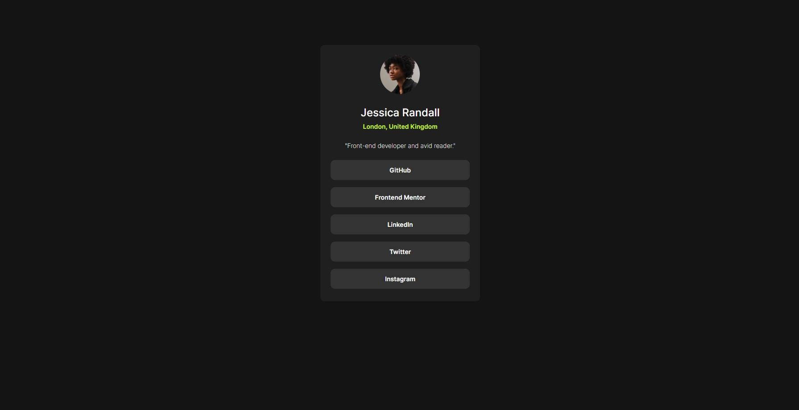

# Frontend Mentor - Social links profile solution

This is a solution to the [Social links profile challenge on Frontend Mentor](https://www.frontendmentor.io/challenges/social-links-profile-UG32l9m6dQ). Frontend Mentor challenges help you improve your coding skills by building realistic projects. 

## Table of contents

- [Overview](#overview)
  - [The challenge](#the-challenge)
  - [Screenshot](#screenshot)
  - [Links](#links)
- [My process](#my-process)
  - [Built with](#built-with)
  - [What I learned](#what-i-learned)
  - [Continued development](#continued-development)
  - [Useful resources](#useful-resources)
- [Author](#author)
- [Acknowledgments](#acknowledgments)

**Note: Delete this note and update the table of contents based on what sections you keep.**

## Overview

### The challenge

Users should be able to:

- See hover and focus states for all interactive elements on the page

### Screenshot


 
### Links
 
- Live Site URL: [Add live site URL here](https://matrix1984.github.io/social-links-profile-main/)

## My process

### Built with

- Semantic HTML5 markup
- CSS custom properties
- CSS Grid 

**Note: These are just examples. Delete this note and replace the list above with your own choices**

### What I learned

I have learned how to build a responsive design using media queries.

```html
<h1>Some HTML code I'm proud of</h1>
```
```css
  @media screen and (min-width: 1440px) {
      .wrapper {
        width: 20%;
      }
    }
```
  

### Continued development

In the future I will experiment with more CSS units in order to achieve a more precise design that will fit all browsers.


### Useful resources

- [Media Queries](https://www.w3schools.com/css/css3_mediaqueries.asp) - This helped me for my media queries. I really liked this pattern and will use it going forward. 
 

## Author
 
- Frontend Mentor - [Dan Friedman](https://github.com/Matrix1984/social-links-profile-main.git)  

## Acknowledgments

I thank the community for any future feedback.
 
